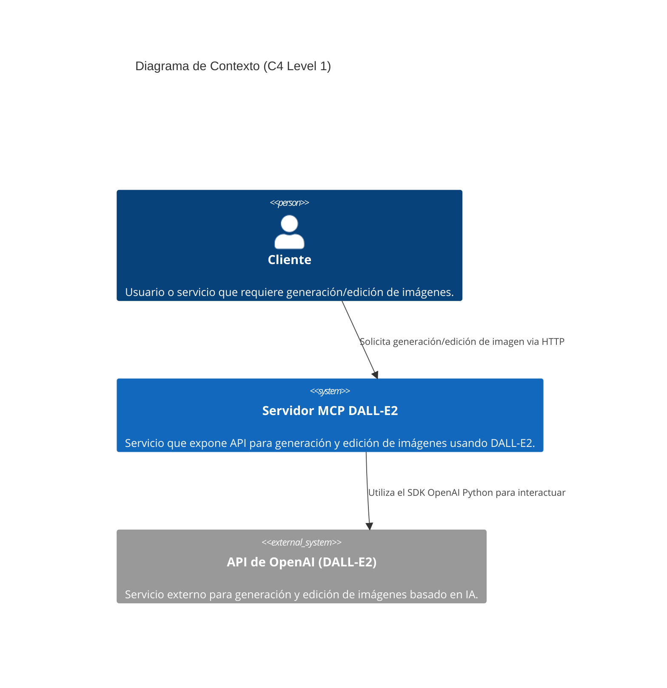

RFC: Implementación de Servidor MCP para Generación y Edición de Imágenes con DALL-E2

**Autor:** Asistente para Generar Documentos Técnicos  
**Fecha:** 07 de julio de 2025  
**Estado:** Draft  
**Versión:** 1.0

-----

## Contexto

La capacidad de generar y editar imágenes programáticamente es cada vez más crucial para diversas aplicaciones, desde la creación de contenido dinámico hasta herramientas de diseño asistido por IA. Actualmente, carecemos de un servicio interno estandarizado y eficiente para interactuar con modelos avanzados de generación de imágenes como DALL-E2. Las implementaciones ad-hoc o el uso directo de APIs de terceros en los servicios de consumo resultan en acoplamiento fuerte, dificultando la gestión de credenciales, el monitoreo del uso y la escalabilidad de las operaciones de generación de imágenes.

El problema específico que se busca resolver es la falta de un endpoint unificado y optimizado para la creación y edición de imágenes mediante inteligencia artificial. Esto se traduce en:

  * **Dependencia directa:** Los servicios consumidores deben manejar la lógica de integración con la API de OpenAI y el SDK, lo que aumenta la complejidad y el mantenimiento en cada servicio.
  * **Gestión de credenciales:** La distribución de claves de API de OpenAI a múltiples servicios representa un riesgo de seguridad y dificulta la rotación y el monitoreo centralizado.
  * **Escalabilidad ineficiente:** No hay un punto centralizado para gestionar el volumen de solicitudes a DALL-E2, lo que podría llevar a límites de tasa y un uso subóptimo de los recursos.
  * **Falta de observabilidad:** Dificultad para monitorear el rendimiento, el uso y los posibles errores en las operaciones de generación de imágenes a través de diferentes servicios.

Es necesario actuar ahora para estandarizar este proceso, reducir la deuda técnica en los servicios de consumo y establecer una base sólida para futuras integraciones con otros modelos de IA o herramientas de edición de imágenes. La implementación de un servidor Model Context Protocol (MCP) nos permitirá abstraer la complejidad del modelo DALL-E2, ofrecer una interfaz consistente y optimizada, y centralizar la lógica de negocio relacionada con la interacción de modelos de IA. Las soluciones existentes (integración directa con OpenAI) no son viables a largo plazo debido a los problemas de acoplamiento, seguridad y escalabilidad mencionados.

-----

## Requerimientos

### Requerimientos Funcionales

  * El servidor MCP debe exponer una API para la generación de imágenes a partir de un prompt de texto y parámetros configurables (ej. tamaño, cantidad).
  * El servidor MCP debe exponer una API para la edición de imágenes existentes a partir de un prompt de texto, una imagen original y una máscara opcional, junto con parámetros configurables.
  * Las herramientas internas para interactuar con el SDK de OpenAI deben soportar el patrón `async/await`.
  * El servidor debe permitir la comunicación de tráfico HTTP streamable para el envío y recepción de datos de imagen.
  * El servidor debe ser capaz de procesar múltiples solicitudes concurrentes de generación y edición de imágenes.
  * El servidor debe retornar las URLs de las imágenes generadas/editadas por DALL-E2.

### Requerimientos No Funcionales

  * **Rendimiento:** La latencia promedio para la generación de una imagen no debe exceder los 5 segundos para el 90% de las solicitudes. Para la edición de imágenes, la latencia promedio no debe exceder los 7 segundos para el 90% de las solicitudes.
  * **Escalabilidad:** El servidor debe ser capaz de manejar hasta 100 solicitudes concurrentes sin degradación significativa del rendimiento (latencia incrementada en no más del 20%).
  * **Disponibilidad:** El servicio debe mantener una disponibilidad del 99.9%.
  * **Seguridad:** Las claves de API de OpenAI deben ser gestionadas de forma segura (ej., variables de entorno, secreto de orquestador) y no hardcodeadas. La comunicación con el servidor MCP debe usar HTTPS.
  * **Observabilidad:** Debe proveer métricas básicas de uso (número de solicitudes, errores, latencia) y logs de los eventos importantes.

### Restricciones

  * Uso del SDK `openai-python` para la interacción con DALL-E2.
  * Uso del SDK `modelcontextprotocol/python-sdk` para la implementación del servidor MCP.
  * Uso de Uvicorn como servidor ASGI.
  * El modelo de generación de imágenes es DALL-E2 (no se considerarán otros modelos en esta fase).
  * Presupuesto limitado para infraestructura, priorizando soluciones de código abierto y eficientes en recursos.
  * El tamaño de las imágenes generadas y editadas estará limitado por las capacidades de DALL-E2.

-----

## Descripción

La solución propuesta consiste en la implementación de un servidor Model Context Protocol (MCP) utilizando el SDK de Python para MCP, el SDK `openai-python` para interactuar con el modelo DALL-E2, y Uvicorn como servidor ASGI para manejar el tráfico HTTP streamable. Este servidor actuará como un proxy centralizado y una capa de abstracción para las operaciones de generación y edición de imágenes.

La solución resolverá el problema de la integración descentralizada con DALL-E2 al proporcionar un endpoint unificado y herramientas específicas para los casos de uso principales.

**Beneficios principales:**

  * **Centralización:** Un único punto de entrada para todas las operaciones de generación y edición de imágenes.
  * **Abstracción:** Los servicios consumidores no necesitan conocer los detalles de la API de OpenAI ni gestionar sus credenciales.
  * **Optimización:** La implementación de `async/await` y tráfico streamable asegura un manejo eficiente de las solicitudes concurrentes y de grandes payloads de datos (imágenes).
  * **Reusabilidad:** Las herramientas MCP encapsulan la lógica de negocio, haciéndolas fácilmente consumibles por diferentes aplicaciones.
  * **Seguridad Mejorada:** La gestión de credenciales se centraliza en el servidor MCP.

**Casos de uso principales:**

1.  **Generación de Imágenes a partir de Texto:** Un cliente envía un prompt de texto y parámetros (ej., `n` cantidad de imágenes, `size` del output). El servidor MCP invoca la herramienta `ImageGenerationTool` que utiliza el SDK de OpenAI para llamar a la API de DALL-E2 y retorna las URLs de las imágenes generadas.
2.  **Edición de Imágenes Existentes:** Un cliente envía una imagen (como `bytes`), un prompt de texto y opcionalmente una máscara. El servidor MCP invoca la herramienta `ImageEditingTool` que utiliza el SDK de OpenAI para llamar a la API de DALL-E2 y retorna las URLs de las imágenes editadas.

-----

## Diseño

### Diagrama de Arquitectura (C4 - Level 2)



**Recomendación de Herramienta:** Dado que el número de componentes principales es bajo (3 en el nivel de contexto), Mermaid es suficiente para este diagrama C4 Context. Para niveles más detallados (Container o Componente) con mayor complejidad, se recomienda el uso de PlantUML con sintaxis C4 o Draw.io, ya que ofrecen mejor control sobre el layout y pueden manejar más componentes y relaciones sin sacrificar la legibilidad.

### Descripción de Componentes

  * **Cliente:** Representa cualquier sistema o usuario que consumirá el servicio MCP. Interactúa con el servidor MCP a través de peticiones HTTP, enviando prompts, imágenes y recibiendo las URLs de las imágenes procesadas.
  * **Servidor MCP DALL-E2:**
      * **Responsabilidad Principal:** Exponer una API para la generación y edición de imágenes, orquestar las llamadas a DALL-E2 y gestionar las herramientas MCP. Actúa como un proxy inteligente entre los clientes y la API de OpenAI.
      * **Tecnología Utilizada:** Python 3.9+, `modelcontextprotocol/python-sdk`, `openai-python` SDK, Uvicorn (servidor ASGI), FastAPI (framework web opcional para routing y validación).
      * **APIs/Interfaces que expone:**
          * `/generate_image`: HTTP POST, recibe JSON con `prompt` y `params` (ej., `n`, `size`). Retorna JSON con `image_urls`.
          * `/edit_image`: HTTP POST, recibe `prompt`, `image_file` (multipart/form-data), `mask_file` (opcional). Retorna JSON con `image_urls`.
      * **Dependencias con otros componentes:** Depende de la API de OpenAI para realizar las operaciones de IA.
  * **API de OpenAI (DALL-E2):**
      * **Responsabilidad Principal:** Proporcionar los servicios de generación y edición de imágenes basados en el modelo DALL-E2.
      * **Tecnología Utilizada:** Servicio propietario de OpenAI.
      * **APIs/Interfaces que expone:** APIs RESTful para `images/generations` e `images/edits`.
      * **Dependencias con otros componentes:** Es una dependencia externa para el servidor MCP.

### Estructura de Archivos

```
.
├── src/
│   ├── main.py                     # Punto de entrada principal del servidor Uvicorn/FastAPI
│   ├── mcp_server/                 # Módulo principal del servidor MCP
│   │   ├── __init__.py
│   │   ├── app.py                  # Definición de la aplicación FastAPI y endpoints
│   │   ├── tools/                  # Definición de las herramientas MCP
│   │   │   ├── __init__.py
│   │   │   ├── image_generation.py # Implementación de ImageGenerationTool (async)
│   │   │   └── image_editing.py    # Implementación de ImageEditingTool (async)
│   │   └── config.py               # Gestión de configuración y claves API
│   └── services/                   # Clientes o wrappers para servicios externos
│       └── openai_client.py        # Wrapper asíncrono para el SDK de OpenAI
├── .env.example                    # Ejemplo de variables de entorno
├── Dockerfile                      # Definición para contenedor Docker
├── requirements.txt                # Dependencias del proyecto
└── README.md                       # Documentación del proyecto
```

### Diagrama de Secuencia

```mermaid
sequenceDiagram
    participant Client
    participant MCPServer as MCP Server DALL-E2
    participant OpenAIAPI as OpenAI API (DALL-E2)

    Client->>MCPServer: POST /generate_image (prompt, params)
    activate MCPServer
    MCPServer->>MCPServer: Validar y parsear solicitud
    MCPServer->>MCPServer: Invocar ImageGenerationTool.run_tool(prompt, params)
    activate MCPServer as Tool
    Tool->>OpenAIAPI: Call DALL-E2 /images/generations (async)
    activate OpenAIAPI
    OpenAIAPI-->>Tool: Return image URLs (async)
    deactivate OpenAIAPI
    Tool-->>MCPServer: Return image URLs
    deactivate Tool
    MCPServer-->>Client: HTTP 200 OK (image URLs)
    deactivate MCPServer

    Client->>MCPServer: POST /edit_image (image_file, prompt, mask_file)
    activate MCPServer
    MCPServer->>MCPServer: Validar y procesar solicitud (manejo de archivos)
    MCPServer->>MCPServer: Invocar ImageEditingTool.run_tool(image_data, prompt, mask_data)
    activate MCPServer as Tool
    Tool->>OpenAIAPI: Call DALL-E2 /images/edits (async)
    activate OpenAIAPI
    OpenAIAPI-->>Tool: Return edited image URLs (async)
    deactivate OpenAIAPI
    Tool-->>MCPServer: Return edited image URLs
    deactivate Tool
    MCPServer-->>Client: HTTP 200 OK (edited image URLs)
    deactivate MCPServer

    alt Error en OpenAI API
        Tool--xOpenAIAPI: Error response (e.g., rate limit, invalid prompt)
        OpenAIAPI--xTool: Propagate error
        Tool--xMCPServer: Propagate error
        MCPServer--xClient: HTTP 500 Internal Server Error (or 4xx if client error)
    end

    alt Solicitud Inválida del Cliente
        Client--xMCPServer: Invalid request payload
        MCPServer--xClient: HTTP 400 Bad Request
    end
```

### Tecnologías

#### Stack Tecnológico

  * **Lenguaje de Programación:** Python 3.10+
  * **Framework Principal (Web):** FastMCP
  * **Servidor ASGI:** Uvicorn
  * **SDK MCP:** `modelcontextprotocol/python-sdk`
  * **SDK OpenAI:** `openai/openai-python`
  * **Gestión de Dependencias:** `pip` y `requirements.txt`
  * **Contenedorización:** Docker (para despliegue)

#### Justificación de Tecnologías

  * **Uvicorn:** Servidor ASGI de alta performance para Python. Es ideal para aplicaciones asíncronas como FastAPI, ofreciendo una excelente capacidad para manejar tráfico HTTP streamable y solicitudes concurrentes de manera eficiente.
  * **`modelcontextprotocol/python-sdk`:** Requisito explícito y fundamental para implementar el servidor MCP. Proporciona las abstracciones y el framework necesarios para definir y gestionar las herramientas de IA de manera estandarizada.
  * **`openai/openai-python` SDK:** Requisito explícito para interactuar con la API de DALL-E2. Es el cliente oficial de OpenAI, garantizando compatibilidad y acceso a las últimas características del modelo. Soporta operaciones asíncronas.

-----

## Fuentes

  * **OpenAI Python SDK:** [https://github.com/openai/openai-python](https://github.com/openai/openai-python)
  * **Model Context Protocol Python SDK:** [https://github.com/modelcontextprotocol/python-sdk](https://github.com/modelcontextprotocol/python-sdk)
  * **Uvicorn Documentation:** [https://www.uvicorn.org/](https://www.uvicorn.org/)
  * **C4 Model for Software Architecture:** [https://c4model.com/](https://c4model.com/)
  * **Mermaid Live Editor:** [https://mermaid.live/](https://mermaid.live/)

-----

**Próximos Pasos:**

1.  Definir los esquemas de request/response para los endpoints de generación y edición de imágenes.
2.  Implementar las herramientas `ImageGenerationTool` e `ImageEditingTool` utilizando el SDK de OpenAI y el patrón `async/await`.
3.  Desarrollar el `main.py` y `app.py` para levantar el servidor Uvicorn con FastAPI y exponer las herramientas MCP.

**Consideraciones de Implementación:**

  * **Manejo de errores:** Implementar un manejo robusto de errores, incluyendo reintentos para fallos transitorios de la API de OpenAI y validación de entradas del cliente.
  * **Autenticación y Autorización:** Aunque no es un requisito directo de este RFC, considerar la implementación de autenticación (ej., API Keys) para el servidor MCP si va a ser expuesto a múltiples clientes internos/externos.
  * **Logging y Métricas:** Integrar librerías de logging (ej., `logging` de Python) y métricas (ej., Prometheus, StatsD) para monitorear el rendimiento y la salud del servicio.
  * **Streaming de Archivos:** Para la edición de imágenes, asegurar que el manejo de archivos (imagen y máscara) se realice de forma eficiente, posiblemente utilizando flujos de datos (`io.BytesIO`) en lugar de cargar archivos completos en memoria para archivos grandes.
  * **Límites de Uso de OpenAI:** Monitorear y gestionar los límites de tasa de la API de DALL-E2 para evitar interrupciones del servicio.
  * **Costos:** Implementar monitoreo de costos asociados al uso de la API de OpenAI.